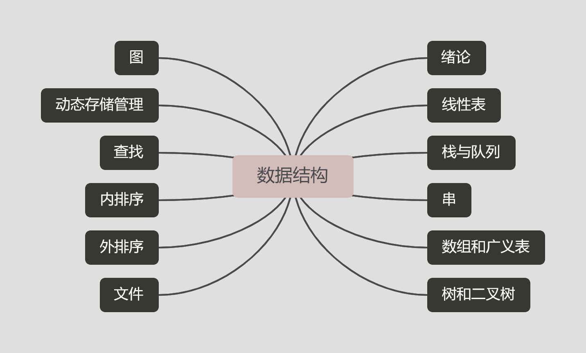

# data-structure🎡

    

## 第一章：绪论

|抽象数据类型或算法|代码|
|--|--|
|三元组|[triplet](./src/preface/code/triplet.cpp)|
|复数|[complex](./src/preface/code/complex.cpp)|
|有理数|[rational_number.cpp](./src/preface/code/rational_number.cpp)|
|三元素最大值|[max3](./src/preface/code/max3.cpp)|
|降序排序三元素|[descend3](./src/preface/code/descend3.cpp)|

### 1.1 [基本概念和术语](./src/preface/基本概念与术语.md)
### 1.2 [抽象数据类型的表示与实现](./src/preface/抽象数据类型的表示与实现.md)
### 1.3 [算法和算法分析](./src/preface/算法和算法分析.md)
### 1.4 [习题与解答](./src/preface/习题与解答.md)

## 第二章：线性表

|抽象数据类型或算法|代码|
|--|--|
|顺序表|[SqList](./src/linear-list/code/sq_list.cpp)|
|单链表|[LinkList](./src/linear-list/code/link_list.cpp)|
|集合运算的算法|[SLinkList](./src/linear-list/code/slink_list.cpp)|
|一元多项式|[Polynomial](./src/linear-list/code/polynomial.cpp)|

### 2.1 [线性表的类型定义](./src/linear-list/线性表的类型定义.md)
### 2.2 [线性表的顺序表示和实现](./src/linear-list/线性表的顺序表示和实现.md)
### 2.3 [线性表的链式表示和实现](./src/linear-list/线性表的链式表示和实现.md)
### 2.4 [习题与解答](./src/linear-list/习题与解答.md)

## 第三章：栈

|抽象数据类型或算法|代码|
|--|--|
|顺序存储结构|[SqStack](./src/stack/code/sq_stack.cpp)|
|链式存储结构|[LinkStack](./src/stack/code/link_stack.cpp)|
|数制转换|[conversion](./src/stack/code/conversion.cpp)|
|括号匹配|[Parenthesis_Match](./src/stack/code/parenthesis_match.cpp)|
|hanoi的递归实现|[hanoi](./src/stack/code/hanoi.cpp)|

### 3.1 [抽象数据类型的定义](./src/stack/抽象数据类型栈的定义.md)
### 3.2 [栈与递归的实现](./src/stack/栈与递归的实现.md)
### 3.3 [习题与解答](./src/stack/习题与解答.md)

## 第四章：队列

|抽象数据类型或算法|代码|
|--|--|
|单链队列|[LinkQueue](./src/queue/code/link_queue.cpp)|
|循环队列|[Circular_Queue](./src/queue/code/circular_queue.cpp)|

### 4.1 [抽象数据类型队列的定义](./src/queue/抽象数据类型队列的定义.md)
### 4.2 [循环队列-队列的顺序表示和实现](./src/queue/循环队列-队列的顺序表示和实现.md)
### 4.3 [习题与解答](./src/queue/习题与解答.md)

## 第五章：串

|抽象数据类型或算法|代码|
|--|--|
|串的堆分配表示（未全部实现，不可运行）|[HeapString](./src/string/code/heap_string.cpp)
|模式匹配算法|[ModeMatch](./src/string/code/mode_matching.cpp)

### 5.1 [串类型的定义](./src/string/串类型的定义.md)
### 5.2 [串的模式匹配算法](./src/string/串的模式匹配算法.md)
### 5.3 [习题与解答](./src/string/习题与解答.md)